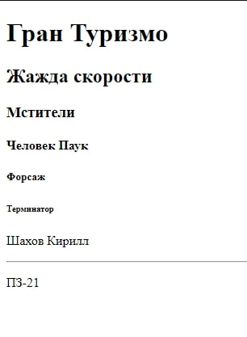
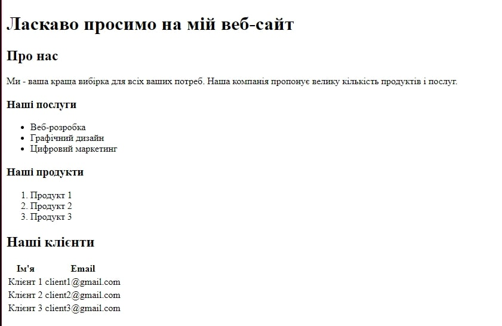

# html-portfolio
<!DOCTYPE html>
<html lang="en">
<head>
    <meta charset="UTF-8">
    <meta name="viewport" content="width=device-width, initial-scale=1.0">
    <title>Ваше ім'я - Портфоліо</title>
    
</head>
<body>

    <header>
        <h1>Ваше Ім'я</h1>
        
Шахов Кирило

    </header>

    <section>
        <h2>Про мене</h2>
        
Вчусь у группі ПЗ-21.

    </section>

    <section>
        <h2>Мої проекти</h2>

        

            <h3>Лабораторна 1</h3>            
            
        

        

            <h3>Лабораторна 2</h3>            
            
        

        <!-- Додайте інші проекти за аналогією -->

    </section>
   

</body>
</html>
